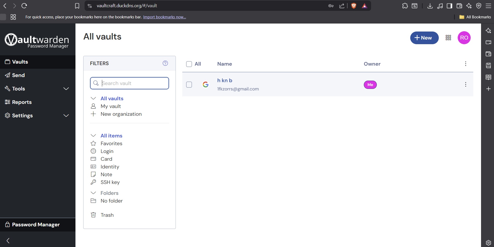

# VaultCraft – Secure Password Manager on AWS EC2

 

## Overview
VaultCraft is a self-hosted password manager deployed on AWS EC2 using Docker, NGINX, and automated HTTPS with Let’s Encrypt Certbot...

## Tech Stack
- Docker & Docker Compose  
- AWS EC2 (Ubuntu)  
- NGINX reverse proxy  
- Let’s Encrypt Certbot for SSL  
- DuckDNS for dynamic DNS  
- Vaultwarden password manager

## Setup Instructions
1. Launch AWS EC2 (Ubuntu) instance  
2. Install Docker & Docker Compose  
3. Clone repo and create docker-compose.yml with Vaultwarden service  
4. Run `docker-compose up -d` to start container  
5. Configure NGINX reverse proxy  
6. Setup DuckDNS dynamic DNS  
7. Obtain SSL certificate with Certbot  
8. Access VaultCraft at https://vaultcraft.duckdns.org

## Features
- Secure password storage  
- Persistent Docker volumes  
- WebSocket support for real-time updates  
- Automated HTTPS  
- Dynamic DNS to handle EC2 IP changes

## Contact
GitHub: [RohanReddy-M](https://github.com/RohanReddy-M)
